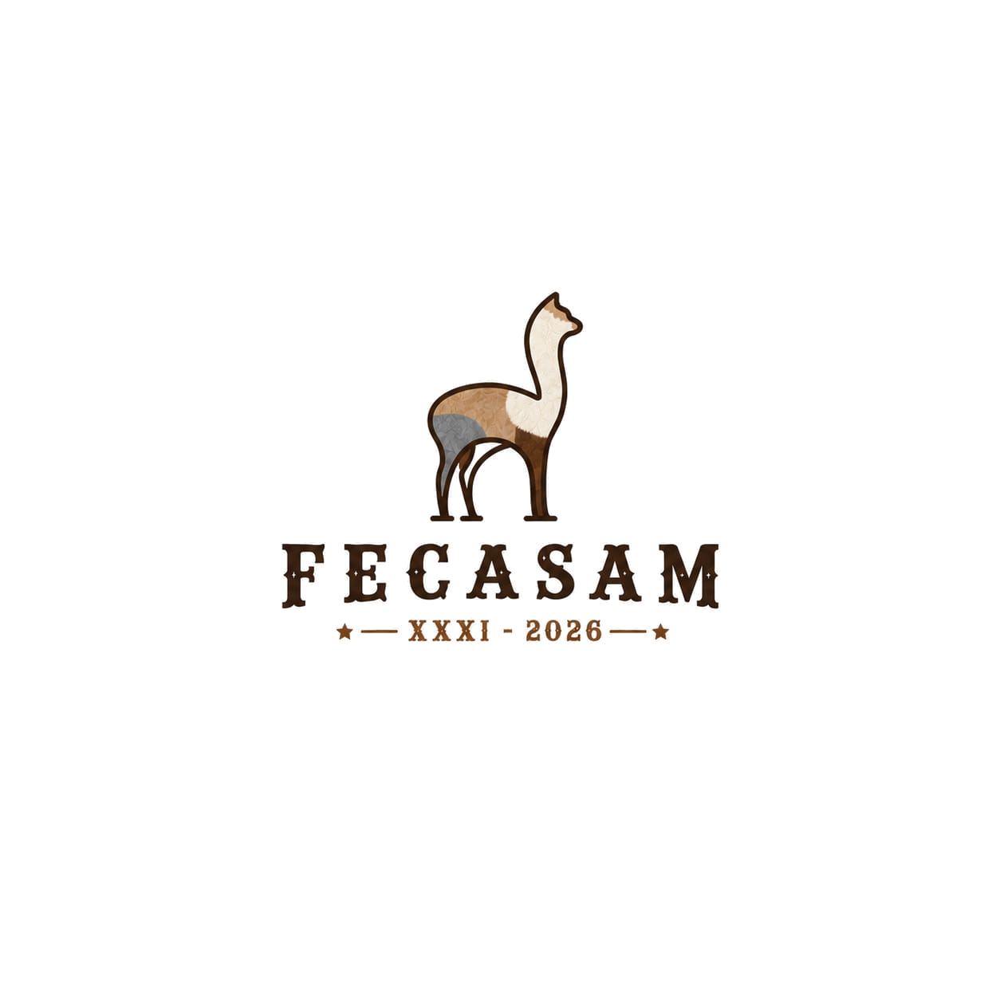

# 🎨 Guía de Personalización FECASAM 2026

Esta guía te muestra cómo personalizar el sitio web según tus necesidades.

## 🎯 Cambios Rápidos (5 minutos)

### 1. Cambiar Colores del Sitio

Edita `assets/css/style.css`, encuentra las variables CSS (líneas 14-30):

```css
:root {
    /* CAMBIA ESTOS VALORES */
    --color-primary: #8B5E3C;        /* Marrón principal */
    --color-secondary: #D4A574;       /* Dorado/Oro */
    --color-accent: #C17817;          /* Dorado oscuro */
    --color-dark: #2C1810;            /* Texto oscuro */
    --color-light: #F5F5F5;           /* Fondo claro */
}
```

**Ejemplo:** Para un esquema azul/verde:
```css
:root {
    --color-primary: #2563EB;         /* Azul */
    --color-secondary: #10B981;       /* Verde */
    --color-accent: #059669;          /* Verde oscuro */
}
```

### 2. Cambiar Información de Contacto

Edita `index.html`, busca la sección de contacto (línea ~750):

```html
<!-- Busca y reemplaza -->
<a href="tel:+51987654321">+51 987 654 321</a>
<a href="mailto:info@fecasam2026.com">info@fecasam2026.com</a>
```

### 3. Actualizar Enlaces de Redes Sociales

En `index.html`, busca `.social-links` (línea ~820):

```html
<a href="https://facebook.com/TU_PAGINA" ...>
<a href="https://instagram.com/TU_CUENTA" ...>
```

### 4. Configurar WhatsApp Flotante

En `index.html`, busca `.floating-contacts` (línea ~870):

```html
<a href="https://wa.me/51987654321?text=TU_MENSAJE_PREDEFINIDO" ...>
```

Cambia el número y el mensaje.

## 🖼️ Personalización de Imágenes

### Reemplazar Logo

1. Prepara tu logo:
   - **Formato:** PNG con transparencia
   - **Tamaño:** ~300x100px
   - **Peso:** <50KB

2. Guárdalo como:
   - `assets/images/logo.png` (para fondo oscuro)
   - `assets/images/logo-light.png` (para fondo claro)

3. Actualiza en `index.html`:
```html

```

### Cambiar Imágenes de Secciones

Reemplaza estas imágenes manteniendo los mismos nombres:
```
assets/images/fibra-alpaca.jpg
assets/images/carne-camelidos.jpg
assets/images/og-image.jpg
```

O cambia las referencias en HTML:
```html

```

### Optimizar Imágenes

Antes de subirlas:
1. Usa [TinyPNG](https://tinypng.com)
2. Tamaño recomendado: 800x600px para contenido
3. Calidad: 80-85%
4. Formato: JPG (fotos) o PNG (logos/gráficos)

## ✏️ Editar Contenido de Texto

### Cambiar el Título Principal

En `index.html`, busca `.hero-title` (línea ~140):

```html
<h1 class="hero-title">
    TU TÍTULO <span class="highlight">2026</span>
</h1>
<p class="hero-subtitle">Tu Subtítulo Aquí</p>
```

### Modificar las Fechas del Evento

Busca `.hero-info` (línea ~150):

```html
<span>DD - DD Mes YYYY</span>
```

### Cambiar Estadísticas

Busca `.stats-grid` (línea ~195):

```html
<h3 class="stat-number">TU NÚMERO</h3>
<p class="stat-label">Tu descripción</p>
```

### Editar Timeline del Programa

Busca `.timeline-item` (línea ~340):

```html
<div class="timeline-date">DD Mes</div>
<h3>Título de la Actividad</h3>
<p>Descripción de la actividad</p>
<span class="timeline-time">HH:MM AM/PM</span>
```

## 📋 Modificar Formularios

### Añadir/Quitar Categorías de Inscripción

En `index.html`, busca el `<select id="category">` (línea ~510):

```html
<select id="category" name="category" required>
    <option value="">Seleccione categoría...</option>
    <option value="nueva-categoria">Nueva Categoría</option>
    <!-- Añade más opciones aquí -->
</select>
```

**Importante:** También actualiza la validación en `assets/js/main.js` y la base de datos.

### Cambiar Campos del Formulario

Para añadir un nuevo campo:

1. Añade en HTML:
```html
<div class="form-group">
    <label for="nuevoCampo">
        <i class="fas fa-icon"></i> Etiqueta *
    </label>
    <input type="text" id="nuevoCampo" name="nuevoCampo" required>
</div>
```

2. Actualiza validación en `assets/js/main.js`

3. Actualiza `api/submit-registration.php` para procesar el nuevo campo

4. Añade columna en la base de datos:
```sql
ALTER TABLE registrations ADD nuevo_campo VARCHAR(255);
```

## 🎨 Personalizar Estilos Avanzados

### Cambiar Fuentes

En `index.html`, modifica el enlace de Google Fonts (línea ~32):

```html
<link href="https://fonts.googleapis.com/css2?family=TU_FUENTE:wght@300;400;700&display=swap" rel="stylesheet">
```

Luego en `assets/css/style.css`:
```css
:root {
    --font-primary: 'Tu Fuente', sans-serif;
}
```

### Ajustar Espaciado

En `assets/css/style.css`:
```css
:root {
    --spacing-sm: 1rem;    /* Pequeño */
    --spacing-md: 2rem;    /* Mediano */
    --spacing-lg: 4rem;    /* Grande */
}
```

### Modificar Bordes Redondeados

```css
:root {
    --radius-sm: 4px;     /* Poco redondeado */
    --radius-md: 8px;     /* Mediano */
    --radius-lg: 16px;    /* Muy redondeado */
}
```

## 📄 Personalizar PDFs Descargables

### Actualizar Enlaces de Descarga

En `index.html`, busca `.resources-grid` (línea ~430):

```html
<a href="assets/downloads/TU_ARCHIVO.pdf" class="resource-card" download>
    <div class="resource-icon">
        <i class="fas fa-file-pdf"></i>
    </div>
    <h3>Título del Documento</h3>
    <p>Descripción</p>
</a>
```

### Añadir Nuevo Recurso

Copia un `.resource-card` existente y modifica:
```html
<a href="assets/downloads/nuevo-documento.pdf" class="resource-card" download>
    <div class="resource-icon">
        <i class="fas fa-file-alt"></i>  <!-- Cambia el icono -->
    </div>
    <h3>Nuevo Documento</h3>
    <p>Descripción del nuevo documento</p>
    <span class="resource-download">
        <i class="fas fa-download"></i> Descargar PDF
    </span>
</a>
```

## 🎬 Personalizar Video Hero

### Opción 1: Cambiar el Video

Reemplaza `assets/videos/hero-alpacas.mp4` con tu propio video.

**Especificaciones:**
- Formato: MP4 (H.264)
- Duración: 15-30 segundos
- Sin audio
- Tamaño: <10MB

### Opción 2: Usar Imagen Estática

En `index.html`, reemplaza el `<video>` (línea ~135):

```html
<!-- ANTES -->
<video class="hero-video" autoplay muted loop playsinline>
    <source src="assets/videos/hero-alpacas.mp4" type="video/mp4">
</video>

<!-- DESPUÉS -->

```

## 🌍 Configuración de SEO

### Actualizar Meta Tags

En `index.html` (líneas 5-25):

```html
<meta name="description" content="Tu descripción aquí (150-160 caracteres)">
<meta name="keywords" content="palabra1, palabra2, palabra3">

<!-- Open Graph -->
<meta property="og:title" content="Tu Título para Redes Sociales">
<meta property="og:description" content="Tu descripción">
<meta property="og:url" content="https://tudominio.com">
```

### Actualizar Sitemap

Edita `sitemap.xml`:

```xml
<url>
    <loc>https://TUDOMINIO.com/</loc>
    <lastmod>2026-MM-DD</lastmod>
</url>
```

## 🔧 Funcionalidades Opcionales

### Activar/Desactivar Libro de Reclamaciones

Para ocultar el botón en el menú:
```css
.btn-reclamaciones {
    display: none;
}
```

### Desactivar Botones Flotantes

```css
.floating-contacts {
    display: none;
}
```

### Cambiar Comportamiento del Scroll

En `assets/js/main.js`, busca `CONFIG` (línea 9):

```javascript
const CONFIG = {
    SCROLL_OFFSET: 80,  // Cambiar espacio del scroll
};
```

## 📱 Ajustes Responsive

### Cambiar Breakpoints

En `assets/css/style.css`, busca las media queries:

```css
/* Tablet */
@media (min-width: 768px) { ... }

/* Desktop */
@media (min-width: 1024px) { ... }
```

## 🎯 Checklist de Personalización

Antes de publicar, verifica que hayas personalizado:

- [ ] Colores del tema
- [ ] Logo y favicon
- [ ] Información de contacto
- [ ] Enlaces de redes sociales
- [ ] Textos principales
- [ ] Fechas del evento
- [ ] Imágenes de contenido
- [ ] PDFs descargables
- [ ] Formulario de inscripción
- [ ] Meta tags SEO
- [ ] Google Analytics ID
- [ ] Credenciales de base de datos

## 💡 Tips Finales

1. **Guarda una copia de seguridad** antes de hacer cambios grandes
2. **Prueba en local** antes de subir a producción
3. **Optimiza las imágenes** antes de subirlas
4. **Mantén consistencia** en colores y estilos
5. **Usa herramientas** como [Coolors](https://coolors.co) para paletas de colores

## 🆘 Ayuda

Si necesitas ayuda:
- Revisa los comentarios en el código
- Consulta README.md para más info
- Verifica la consola del navegador (F12) para errores

---

**¡Buena suerte personalizando tu sitio!** 🎨
