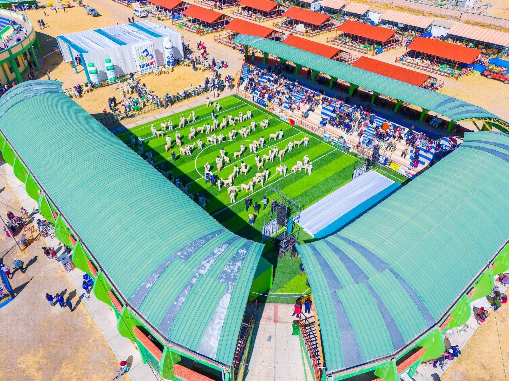

# FECASAM 2026 - Landing Page



Landing page profesional para la XXXI edición de FECASAM 2026 - Feria Exposición de Camélidos Sudamericanos, Agropecuarios y Artesanales en Macusani, Carabaya, Puno.

## 📋 Descripción

Sitio web moderno y responsive diseñado para promover FECASAM 2026, el evento alpaquero más importante de la región de Carabaya.

### Características Principales

- ✅ Diseño moderno y responsive (mobile-first)
- ✅ Optimizado para SEO
- ✅ Formulario de inscripción funcional
- ✅ Libro de Reclamaciones Virtual (conforme a INDECOPI)
- ✅ Sistema de recursos descargables
- ✅ Integración con redes sociales
- ✅ Botones flotantes de contacto (WhatsApp, Messenger)
- ✅ Optimizado para Hostinger
- ✅ Seguridad implementada (.htaccess, headers)
- ✅ Compresión GZIP
- ✅ Caché del navegador configurado

## 🚀 Tecnologías Utilizadas

- **Frontend:**
  - HTML5 semántico
  - CSS3 (con variables CSS)
  - JavaScript vanilla (ES6+)
  - Font Awesome 6.4.0
  - Google Fonts (Montserrat, Playfair Display)

- **Backend:**
  - PHP 7.4+ / 8.0+
  - MySQL 5.7+ / MariaDB 10.3+

- **Hosting:**
  - Optimizado para Hostinger Shared Hosting
  - Compatible con cPanel

## 📁 Estructura del Proyecto

```
FECASAM 2026/
│
├── index.html                  # Página principal
├── libro-reclamaciones.html    # Libro de reclamaciones
├── 404.html                    # Página de error 404
├── .htaccess                   # Configuración Apache
│
├── assets/
│   ├── css/
│   │   └── style.css          # Estilos principales
│   ├── js/
│   │   └── main.js            # JavaScript principal
│   ├── images/                # Imágenes del sitio
│   │   ├── logo.png
│   │   ├── logo-light.png
│   │   ├── favicon.png
│   │   ├── og-image.jpg
│   │   ├── fibra-alpaca.jpg
│   │   └── carne-camelidos.jpg
│   ├── videos/                # Videos
│   │   └── hero-alpacas.mp4
│   └── downloads/             # PDFs descargables
│       ├── programa-fecasam-2026.pdf
│       ├── bases-concurso.pdf
│       ├── ruta-paqochanan.pdf
│       ├── catalogo-expositores.pdf
│       └── manual-biotecnologia.pdf
│
├── api/
│   ├── submit-registration.php # Handler inscripciones
│   └── submit-complaint.php    # Handler reclamaciones
│
├── database/
│   └── schema.sql             # Esquema de base de datos
│
├── docs/
│   ├── DEPLOYMENT.md          # Guía de despliegue
│   └── MAINTENANCE.md         # Guía de mantenimiento
│
└── README.md                  # Este archivo
```

## 🔧 Instalación y Configuración

### Requisitos Previos

- Hosting con PHP 7.4+ y MySQL 5.7+
- Acceso a cPanel o SSH
- Cliente FTP (FileZilla recomendado)
- Dominio registrado

### Paso 1: Preparar Archivos

1. Descarga todos los archivos del proyecto
2. Asegúrate de tener todos los recursos necesarios en `assets/`

### Paso 2: Configurar Base de Datos

1. Accede a **cPanel > phpMyAdmin**
2. Crea una nueva base de datos llamada `fecasam2026`
3. Importa el archivo `database/schema.sql`
4. Crea un usuario de base de datos y asígnale permisos

### Paso 3: Configurar PHP

1. Edita `api/submit-registration.php`
2. Actualiza las credenciales de la base de datos:

```php
define('DB_HOST', 'localhost');
define('DB_NAME', 'fecasam2026');
define('DB_USER', 'tu_usuario');
define('DB_PASS', 'tu_contraseña');
define('ADMIN_EMAIL', 'tu@email.com');
```

### Paso 4: Subir Archivos a Hostinger

#### Opción A: Via File Manager (cPanel)

1. Accede a **cPanel > File Manager**
2. Navega a `public_html/`
3. Sube todos los archivos del proyecto
4. Asegúrate de que `.htaccess` esté visible (mostrar archivos ocultos)

#### Opción B: Via FTP

1. Abre FileZilla
2. Conecta usando tus credenciales FTP
3. Sube todos los archivos a `public_html/`

### Paso 5: Configurar Permisos

Establece los siguientes permisos (chmod):

```
Directorios: 755
Archivos: 644
.htaccess: 644
archivos PHP: 644
```

### Paso 6: Verificar Instalación

1. Visita `https://tudominio.com`
2. Verifica que la página cargue correctamente
3. Prueba el formulario de inscripción
4. Revisa el libro de reclamaciones

## 📧 Configuración de Email

Para que los correos funcionen correctamente:

1. Accede a **cPanel > Email Accounts**
2. Crea la cuenta `inscripciones@tudominio.com`
3. Actualiza `ADMIN_EMAIL` en los archivos PHP
4. Verifica que PHP `mail()` esté habilitado en el servidor

### Opcional: Usar SMTP

Para mejor deliverability, considera usar PHPMailer con SMTP:

```php
// Instalar PHPMailer via Composer
composer require phpmailer/phpmailer

// Configurar SMTP en tus scripts
```

## 🔒 Seguridad

### Checklist de Seguridad

- ✅ Headers de seguridad configurados
- ✅ Protección contra inyección SQL (PDO prepared statements)
- ✅ Sanitización de inputs
- ✅ Protección contra XSS
- ✅ CSRF tokens (implementar en producción)
- ✅ Validación de datos en cliente y servidor
- ✅ Archivos sensibles protegidos

### Cambiar Contraseña de Admin

```sql
-- Generar hash de nueva contraseña
UPDATE admin_users 
SET password_hash = PASSWORD('nueva_contraseña_segura') 
WHERE username = 'admin';
```

## 🎨 Personalización

### Cambiar Colores

Edita las variables CSS en `assets/css/style.css`:

```css
:root {
    --color-primary: #8B5E3C;    /* Tu color */
    --color-secondary: #D4A574;   /* Tu color */
    /* ... */
}
```

### Cambiar Imágenes

Reemplaza las imágenes en `assets/images/` manteniendo los mismos nombres o actualiza las referencias en HTML.

### Modificar Contenido

Edita `index.html` y actualiza:
- Textos
- Fechas
- Enlaces a redes sociales
- Información de contacto

## 📱 Responsive Design

El sitio es completamente responsive y se adapta a:

- 📱 Móviles (320px - 767px)
- 📱 Tablets (768px - 1023px)
- 💻 Desktop (1024px+)

## 🚀 Optimización de Rendimiento

### Optimizaciones Implementadas

1. **Compresión GZIP** activada
2. **Browser caching** configurado (1 año para assets)
3. **Lazy loading** de imágenes
4. **Minificación** recomendada para producción
5. **CDN** para librerías externas

### Mejoras Adicionales (Opcional)

```bash
# Minificar CSS
npm install -g csso-cli
csso assets/css/style.css -o assets/css/style.min.css

# Minificar JavaScript
npm install -g terser
terser assets/js/main.js -o assets/js/main.min.js -c -m

# Optimizar imágenes
npm install -g imagemin-cli
imagemin assets/images/* --out-dir=assets/images/optimized
```

## 📊 Analytics

### Google Analytics (Recomendado)

Añade antes de `</head>` en todas las páginas:

```html
<!-- Google Analytics -->
<script async src="https://www.googletagmanager.com/gtag/js?id=GA_MEASUREMENT_ID"></script>
<script>
  window.dataLayer = window.dataLayer || [];
  function gtag(){dataLayer.push(arguments);}
  gtag('js', new Date());
  gtag('config', 'GA_MEASUREMENT_ID');
</script>
```

## 🐛 Solución de Problemas

### El formulario no envía datos

1. Verifica que PHP esté instalado: `<?php phpinfo(); ?>`
2. Revisa permisos de archivos PHP (644)
3. Verifica conexión a base de datos
4. Revisa logs de error: `cPanel > Error Log`

### Archivos CSS/JS no cargan

1. Verifica rutas en HTML
2. Limpia caché del navegador
3. Verifica permisos de archivos

### Emails no se envían

1. Verifica configuración de `mail()` en servidor
2. Revisa spam folder
3. Considera usar SMTP

### Error 500

1. Revisa `.htaccess`
2. Verifica versión de PHP
3. Revisa error logs
4. Comenta secciones de `.htaccess` para identificar problema

## 📝 Mantenimiento

### Tareas Regulares

- **Diario:** Revisar inscripciones nuevas
- **Semanal:** Backup de base de datos
- **Mensual:** Actualizar contenido, revisar analytics
- **Actualizar PHP/MySQL** cuando sea necesario

### Backup Automático

Añade en cron (cPanel):

```bash
# Backup diario a las 2 AM
0 2 * * * mysqldump -u usuario -p'contraseña' fecasam2026 > /home/usuario/backups/fecasam_$(date +\%Y\%m\%d).sql
```

## 🤝 Soporte

Para soporte técnico:

- 📧 Email: soporte@fecasam2026.com
- 📞 Teléfono: +51 987 654 321
- 💬 WhatsApp: [Enlace directo]

## 📄 Licencia

© 2026 FECASAM - Todos los derechos reservados

---

**Desarrollado con ❤️ para la Capital Alpaquera del Mundo**

Macusani, Carabaya, Puno - Perú
